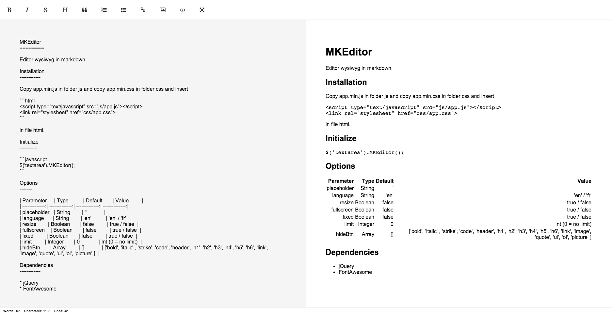

MKEditor
========

Editor wysiwyg in markdown.



Installation
------------

Copy mkeditor.min.js in folder js and copy mkeditor.min.css in folder css and insert

```html
<script type="text/javascript" src="js/mkeditor.min.js"></script>
<link rel="stylesheet" href="css/mkeditor.min.css">
```

in file html.

Initialize
----------

```javascript
$('textarea').MKEditor();
```

Options
-------

| Parameter     | Type          | Default       | Value         |
| -------------:| -------------:| -------------:| -------------:|
| placeholder   | String        | ''            |               |
| language      | String        | 'en'          | 'en' / 'fr'   |
| resize        | Boolean       | false         | true / false  |
| fullscreen    | Boolean       | false         | true / false  |
| fixed         | Boolean       | false         | true / false  |
| limit         | Integer       | 0             | Int (0 = no limit)  |
| hideBtn       | Array         | []            | ['bold', 'italic' , 'strike', 'code', 'header', 'h1', 'h2', 'h3', 'h4', 'h5', 'h6', 'link', 'image', 'quote', 'ul', 'ol', 'picture' ]  |
| upload        | String        | ''            | http://example.fr  |

Dependencies
------------

* jQuery
* FontAwesome

Contributing
------------

Christopher Jeffrey => [chjj/marked](https://github.com/chjj/marked) : A markdown parser and compiler. Built for speed.

Licence
-------

This plugin is available under the ISC license.